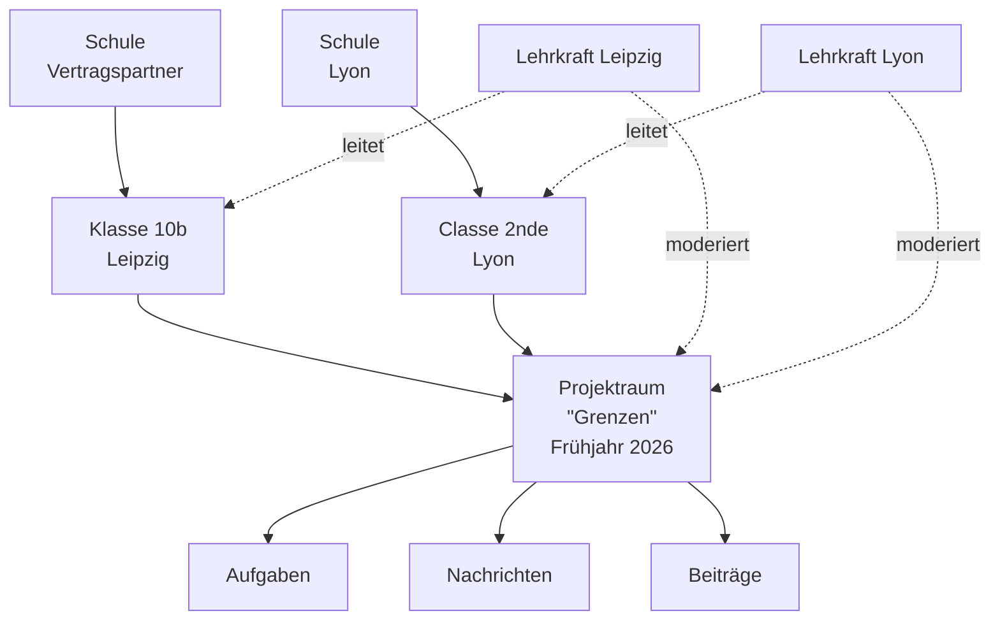
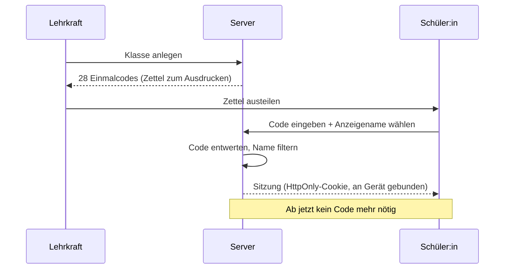
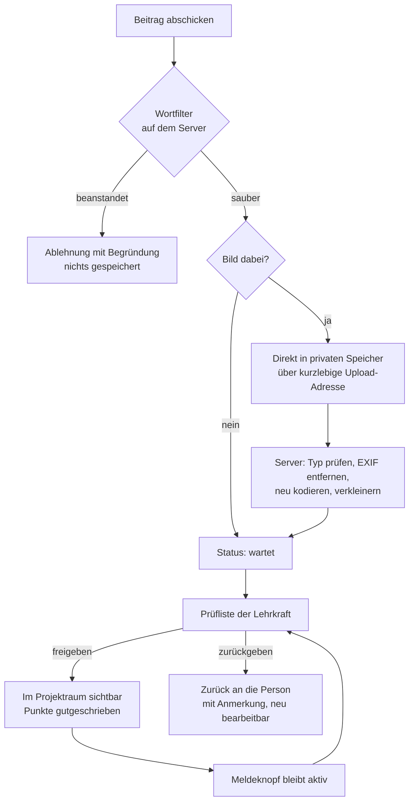

# hey EU — Skizze für die Serverfassung

Wie aus der Einzelseite eine Plattform wird, die mehrere Klassen in mehreren
Ländern gleichzeitig benutzen können.

Stand: Entwurf. Nichts davon ist gebaut, alles ist verhandelbar.

---

## 1. Was die Architektur bestimmt

Nicht die Funktionen bestimmen den Aufbau, sondern **wer die Nutzer sind: Minderjährige
im Schulkontext.** Daraus folgt fast alles Weitere.

| Randbedingung | Was sie erzwingt |
|---|---|
| Nutzer sind 13–18 | Keine Selbstregistrierung, keine E-Mail-Adressen von Schüler:innen, keine offene Suche nach Personen |
| Schulen sind verantwortlich | Lehrkräfte müssen sehen und löschen können, was ihre Klasse tut — inklusive Nachweis, wer was freigegeben hat |
| Mehrere Länder | Hosting in der EU, mehrsprachige Oberfläche, Zeitzonen |
| Fotos aus Klassenräumen | Ortsdaten in Bildern entfernen, nie öffentlich ausliefern, kurze Aufbewahrung |
| Schul-IT ist restriktiv | Ein Port, keine exotischen Protokolle, Betrieb ohne App-Installation |

Zwei Grundsätze, die ich durchziehen würde:

**Nichts erheben, was nicht gebraucht wird.** Kein Klarname, kein Geburtsdatum,
keine Adresse, keine E-Mail von Schüler:innen. Ein Anzeigename und ein Land reichen
für alles, was die Seite tut.

**Der Server glaubt dem Browser nichts.** Punkte, Freigaben, Rollen und der Wortfilter
werden serverseitig entschieden. Die Prüfung im Browser ist nur dazu da, dass eine
Rückmeldung sofort kommt.

---

## 2. Wer gehört wozu



Der **Projektraum** ist die zentrale Einheit. Er hat einen Anfang und ein Ende,
und er ist die Grenze für alles: Wer nicht im selben Projektraum ist, sieht dich
nicht, kann dir nicht schreiben und deine Beiträge nicht lesen. Jede Datenbankabfrage
wird darauf eingeschränkt — das ist die wichtigste einzelne Sicherheitsmaßnahme.

**Rollen**

| Rolle | Darf |
|---|---|
| Schüler:in | Profil im Projektraum, Karte, schreiben an Mitglieder desselben Projektraums, Beiträge einreichen, melden |
| Lehrkraft | alles davon, plus Aufgaben einstellen, Beiträge prüfen, Meldungen bearbeiten, Mitglieder stummschalten, Klasse exportieren und löschen |
| Schuladmin | Lehrkräfte anlegen, Projekträume eröffnen, Aufbewahrungsfristen setzen |

Die Rolle steht in der Sitzung auf dem Server, nicht im Browser. Es gibt keine PIN,
die man abschreiben kann.

---

## 3. Anmeldung ohne Daten der Schüler:innen



- Der Code funktioniert **einmal** und läuft nach 14 Tagen ab.
- Verliert jemand den Zugang, stellt die Lehrkraft einen neuen Code aus — sie sieht
  dabei nur den Anzeigenamen, nie ein Passwort.
- Lehrkräfte melden sich normal an: E-Mail, Passwort, zweiter Faktor.
  Wenn die Schule ein Anmeldesystem hat, geht auch das (OIDC) — dann muss die Plattform
  gar keine Passwörter speichern.

---

## 4. Was der Server ist

Bewusst langweilig gewählt, damit eine Schul-IT es betreiben kann.

| Baustein | Vorschlag | Warum |
|---|---|---|
| Anwendung | TypeScript, Fastify | Dieselbe Sprache wie im Browser, die Filterlisten und Kartendaten werden geteilt statt doppelt gepflegt |
| Datenbank | PostgreSQL | Kann alles, was hier gebraucht wird, inklusive Volltext |
| Dateien | S3-kompatibler Speicher, EU-Region | Bilder gehören nicht in die Datenbank |
| Sitzungen, Ratenbegrenzung | Redis | Auch der Verteiler für Echtzeit über mehrere Prozesse |
| Echtzeit | WebSocket, ein Raum je Projektraum | Fällt auf Abfrage im Intervall zurück, wenn die Schule WebSockets blockt |

Ein einzelner Server plus verwaltete Datenbank trägt eine dreistellige Zahl
gleichzeitiger Klassen. Skalierung ist hier kein Thema und sollte auch keines werden.

---

## 5. Datenmodell

Nur die tragenden Tabellen, gekürzt.

```sql
schule        (id, name, land, aufbewahrung_tage)
konto         (id, schule_id, email, passwort_hash, rolle)      -- nur Lehrkräfte
klasse        (id, schule_id, name, leitung_konto_id)

projektraum   (id, name, beginnt_am, endet_am, moderation)      -- 'vorab' | 'nachtraeglich'
teilnahme     (projektraum_id, klasse_id)

mitglied      (id, projektraum_id, klasse_id, anzeigename, land,
               alter_jahre, interessen[], stift, ist_lehrkraft,
               konto_id NULL,                                    -- nur bei Lehrkräften
               stumm_bis NULL)

beitritt_code (id, klasse_id, code_hash, eingeloest_am, laeuft_ab_am)
sitzung       (id, mitglied_id, geraet_hash, gueltig_bis)

aufgabe       (id, projektraum_id, autor_mitglied_id, titel, text,
               land NULL, punkte, sichtbar_ab, zurueckgezogen_am)

beitrag       (id, aufgabe_id, mitglied_id, text, bild_schluessel NULL,
               status, notiz, geprueft_von, geprueft_am)         -- 'wartet'|'frei'|'zurueck'

nachricht     (id, projektraum_id, von_mitglied_id, an_mitglied_id,
               text, gefiltert, gesendet_am, geloescht_am)

fortschritt   (mitglied_id, land, wahrzeichen_am, frage_richtig_am, punkte)
meldung       (id, projektraum_id, melder_id, bezug_typ, bezug_id, grund, erledigt_am)
pruefspur     (id, projektraum_id, akteur_id, handlung, bezug, zeitpunkt)  -- nur anfügen
```

Drei Dinge sind hier Absicht:

**`mitglied` statt `nutzer`.** Eine Person hat pro Projektraum einen eigenen Eintrag.
Wenn der Projektraum gelöscht wird, verschwindet die Person mit — es bleibt kein
zentrales Verzeichnis von Minderjährigen übrig.

**`pruefspur` wird nur angefügt, nie geändert.** Wer was freigegeben oder abgelehnt
hat, muss auch später noch nachvollziehbar sein.

**`fortschritt` liegt beim Server.** Punkte werden nicht gemeldet, sondern hergeleitet:
Der Server kennt die Kartendaten und rechnet selbst nach, ob jemand wirklich am
Wahrzeichen stand.

---

## 6. Der Weg eines Beitrags

Der heikelste Pfad, weil hier Minderjährige Bilder hochladen.



Zur Bildverarbeitung im Einzelnen:

- **Ortsdaten raus.** Handyfotos tragen oft GPS-Koordinaten im EXIF-Block. Bei einem
  Foto aus dem Klassenraum eines Kindes ist das die Schuladresse. Das Bild wird
  serverseitig neu kodiert, damit sämtliche Metadaten verschwinden.
- **Neu kodieren, nicht nur prüfen.** Das erledigt nebenbei Dateien, die gleichzeitig
  Bild und etwas anderes sind.
- **Nie öffentlich.** Der Speicher hat keine öffentlichen Adressen. Ausgeliefert wird
  über den Server, der vorher prüft, ob die anfragende Person im Projektraum ist,
  mit einer Adresse, die nach Minuten verfällt.
- **Grenzen.** Ein Bild je Beitrag, höchstens 8 MB, nur JPEG/PNG/WebP, höchstens
  20 Uploads pro Person und Tag.

---

## 7. Nachrichten

Was sich gegenüber der jetzigen Seite ändern muss:

- **Nur innerhalb des Projektraums.** Kein Verzeichnis aller Nutzer, keine Suche
  über Projekträume hinweg.
- **Der Filter läuft auf dem Server**, mit derselben Liste. Zusätzlich kann eine
  Lehrkraft Begriffe für ihren Projektraum ergänzen.
- **Ratenbegrenzung**: 20 Nachrichten pro Minute, 300 pro Tag. Nicht gegen Angriffe,
  sondern gegen Streit, der eskaliert.
- **Vorab-Moderation als Schalter.** Bei jüngeren Gruppen kann eine Lehrkraft
  einstellen, dass Nachrichten zwischen Klassen erst nach Sichtung zugestellt werden.
  Für Ältere ist das unangemessen — deshalb pro Projektraum entscheidbar, nicht global.
- **Meldeknopf an jeder Nachricht**, der bei beiden beteiligten Lehrkräften landet.
- **Stummschalten statt Löschen.** Eine Lehrkraft kann jemanden befristet stumm
  schalten; die Person sieht, bis wann und warum.

Ehrlich gesagt: Der Wortfilter fängt Beschimpfungen ab, aber nicht Ausgrenzung,
Anspielungen oder Druck. Der Meldeknopf und die Aufmerksamkeit der Lehrkräfte sind
der eigentliche Schutz, die Technik ist nur die Vorsortierung. Das sollte in der
Oberfläche auch so gesagt werden, statt Sicherheit zu versprechen.

---

## 8. Schnittstelle

```
POST   /api/beitritt              Code + Anzeigename  → Sitzung
POST   /api/anmeldung             Lehrkraft           → Sitzung
DELETE /api/sitzung

GET    /api/projektraum/:id       Stammdaten, eigene Rolle
GET    /api/projektraum/:id/mitglieder
PATCH  /api/mitglied/ich          Anzeigename, Interessen, Stift

GET    /api/aufgaben
POST   /api/aufgaben              nur Lehrkraft
DELETE /api/aufgaben/:id          zurückziehen, nur Lehrkraft

POST   /api/beitraege             Text (+ Bildschlüssel)
POST   /api/uploads               → kurzlebige Upload-Adresse
GET    /api/beitraege             gefiltert nach Sichtbarkeit für die Rolle
POST   /api/beitraege/:id/pruefen freigeben | zurückgeben + Anmerkung

GET    /api/nachrichten/:mitglied
POST   /api/nachrichten
POST   /api/meldungen

POST   /api/fortschritt/ankunft   Feldkoordinate → Server prüft und vergibt Punkte
POST   /api/fortschritt/antwort   Land + Antwort → Server prüft

GET    /api/export/klasse/:id     ZIP mit allen Beiträgen, nur Lehrkraft
DELETE /api/klasse/:id            endgültig, mit Bestätigung
WS     /ws/projektraum/:id        Nachrichten, Freigaben, Statusänderungen
```

Auffällig: `/api/fortschritt/*` nimmt **keine Punktzahl** entgegen, nur was jemand
getan hat. Wie viel das wert ist, entscheidet der Server.

---

## 9. Was am Ende passiert

Der am häufigsten vergessene Teil.

- Ein Projektraum hat ein Enddatum. Danach ist er **nur noch lesbar**.
- Vor dem Löschen bekommt die Lehrkraft einen Export: alle Aufgaben und freigegebenen
  Beiträge als PDF und als ZIP mit den Originalbildern.
- Nach der Aufbewahrungsfrist der Schule (Vorschlag: 90 Tage nach Ende) wird
  **hart gelöscht** — Mitglieder, Nachrichten, Bilder. Es bleibt eine Zeile in der
  Prüfspur, dass gelöscht wurde, ohne Inhalte.
- Einzelne können jederzeit austreten; ihre Nachrichten werden dann durch
  „Beitrag entfernt“ ersetzt, damit Gespräche für die anderen lesbar bleiben.

---

## 10. Wie man dahin kommt

Die jetzige Seite ist ein brauchbarer Anfang, weil sie den ganzen Ablauf schon zeigt.
Sie ist nur an einer Stelle falsch gebaut: Sie glaubt sich selbst.

**Erst** — Zugriffe auf `localStorage` hinter eine schmale Schicht legen
(`speicher.laden()` / `speicher.sichern()`). Kein sichtbarer Unterschied, aber danach
gibt es genau eine Stelle, die man austauscht.

**Dann** — Server mit Anmeldung, Projekträumen, Aufgaben und Beiträgen. Nachrichten
zunächst über Abfrage im Intervall, Echtzeit später. Ab hier ist es echt benutzbar,
in einer Klasse, mit einer Lehrkraft.

**Danach** — WebSocket, Meldungen, Export und Löschung, mehrsprachige Oberfläche.
Ein zweites Land dazunehmen, sobald das erste zufrieden ist.

Was ich **nicht** früh bauen würde: eine Handy-App (die Seite tut es), Videochat
(ganz eigene Aufsichtsfrage), automatische Bilderkennung (teuer und ungenau, die
Lehrkraft sieht ohnehin jedes Bild), Punkte-Ranglisten zwischen Klassen (macht aus
Austausch einen Wettbewerb).

---

## 11. Was ich nicht weiß

Das hier sind Annahmen, die die Skizze tragen — wenn eine davon falsch ist, ändert
sich etwas Wesentliches:

1. **Eine Schule oder viele?** Ich habe für mehrere gebaut (Mandanten getrennt). Für
   ein einziges Gymnasium wäre das überkonstruiert.
2. **Wer betreibt es?** Schul-IT, ein Verein, ein Ministerium? Davon hängt ab, wie
   viel Selbstverwaltung eingebaut sein muss.
3. **Gibt es schon Anmeldesysteme an den Schulen?** Wenn ja, spart der Anschluss
   daran die gesamte Passwortverwaltung.
4. **Wie alt sind die Jüngsten wirklich?** Unter 16 gilt in mehreren EU-Ländern eine
   Einwilligung der Eltern — das ist eher ein Formular- als ein Technikproblem, muss
   aber vorher geklärt sein.
5. **Sollen Beiträge über den Projektraum hinaus sichtbar sein**, etwa auf einer
   Schulwebseite? Dann braucht es eine zweite, ausdrückliche Freigabestufe.
